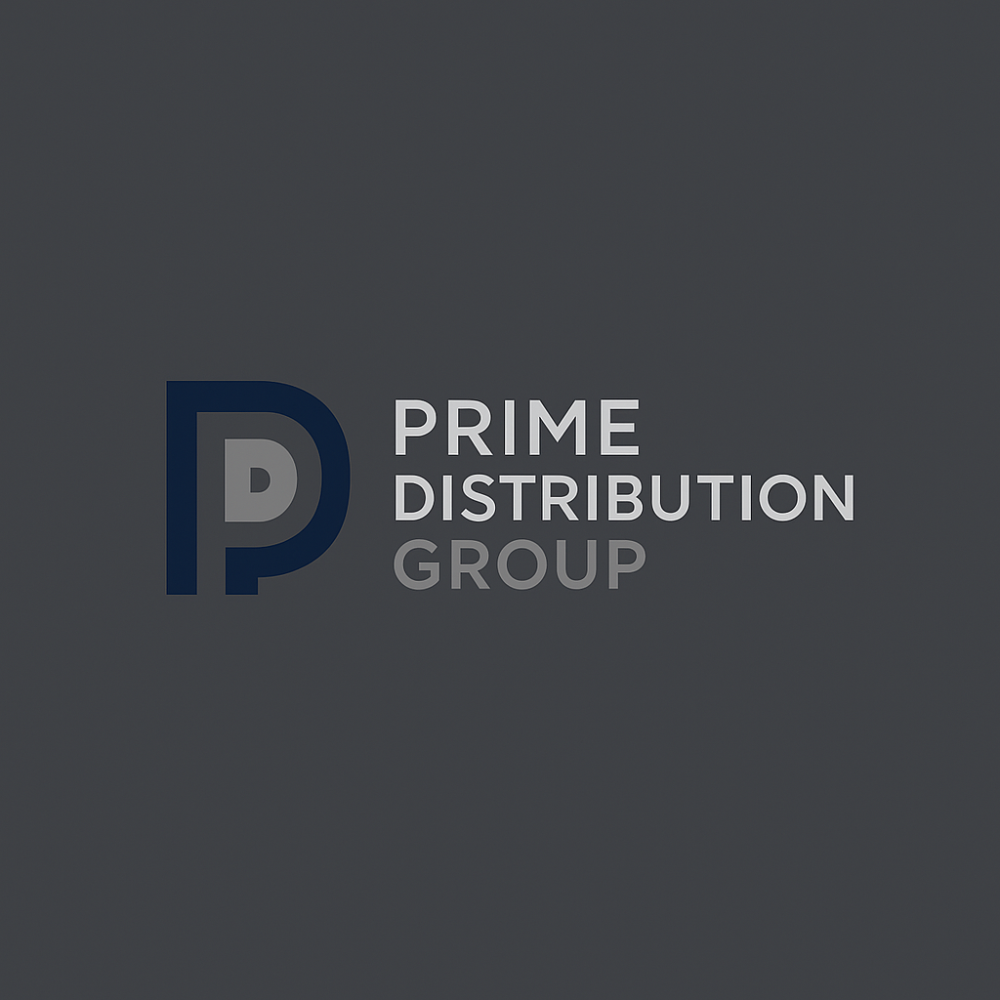

<!DOCTYPE html>
<html lang="pl">
<head>
    <meta charset="UTF-8">
    <meta name="viewport" content="width=device-width, initial-scale=1.0">
    <title>Prime Distribution Group</title>
    
</head>
<body>
    <header>
        
        <h1 id="title">Prime Distribution Group</h1>
        <select id="lang-selector" onchange="changeLanguage(this.value)">
            <option value="pl">Polski</option>
            <option value="en">English</option>
            <option value="de">Deutsch</option>
            <option value="zh">中文 (简体)</option>
        </select>
    </header>
    <main>
        <section id="about-us">
            <h2 id="about-title">O nas</h2>
            

            

            

        </section>
        <section id="import">
            <h2 id="import-title"></h2>
            

            

            

            

            

        </section>
        <section id="import-scale">
            <h2 id="scale-title"></h2>
            

            <h3 id="scale-params-title"></h3>
            <ul>
                <li id="scale-param1"></li>
                <li id="scale-param2"></li>
            </ul>
            <h3 id="scale-coop-title"></h3>
            <ul>
                <li id="scale-coop1"></li>
                <li id="scale-coop2"></li>
                <li id="scale-coop3"></li>
                <li id="scale-coop4"></li>
            </ul>
            <h3 id="scale-benefits-title"></h3>
            <ul>
                <li id="scale-benefit1"></li>
                <li id="scale-benefit2"></li>
                <li id="scale-benefit3"></li>
            </ul>
        </section>
        <section id="payment-methods">
            <h2 id="payment-title"></h2>
            

        </section>
        
    </main>
    <footer>
        

            
            
            
        

        

    </footer>
    
</body>
</html>
